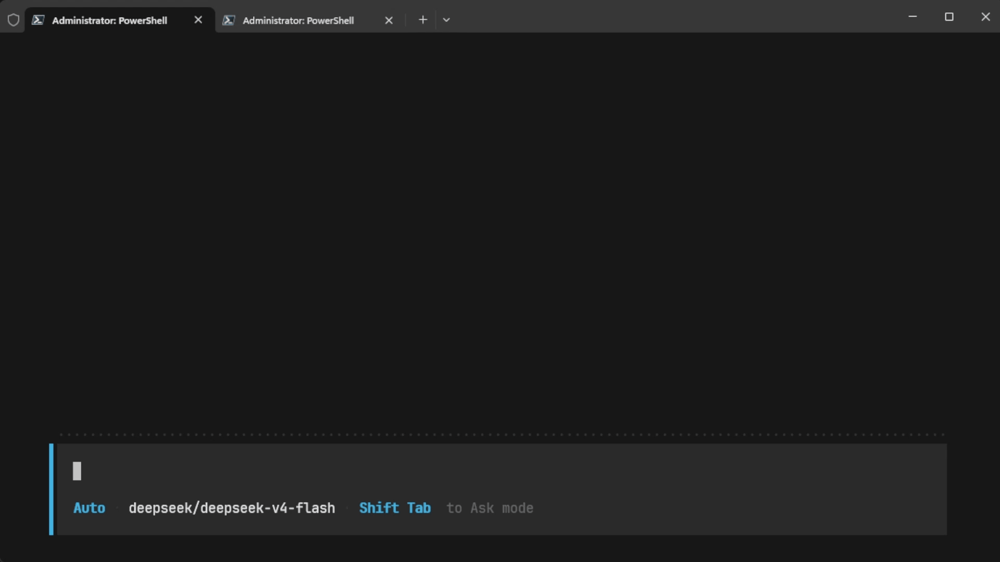

# warden

[](https://github.com/elev1e1nSure/warden/actions/workflows/ci.yml)
[](LICENSE)

[English](README.md)

CLI-агент для управления компьютером. Go TUI + Python-бэкенд + Ollama.



## стек

| слой | технология |
|---|---|
| фронтенд | Go 1.24+, bubbletea, lipgloss |
| бэкенд | Python 3.11+, aiohttp |
| llm | Ollama (qwen3:8b) или удалённый OpenAI-совместимый API (OpenRouter) |
| управление ПК | pyautogui, Pillow |
| браузер | Playwright |
| поиск | duckduckgo-search |

## архитектура

```
go tui (bubbletea)
    ↓ HTTP NDJSON
python backend (aiohttp, localhost:8765)
    ↓
ollama
    ↓
[powershell] [файловая система] [скриншот] [мышь/клавиатура] [браузер] [поиск]
```

фронтенд и бэкенд разделены: TUI ничего не знает об Ollama, бэкенд ничего не знает об UI.

## структура

```
warden/
├── go/
│   ├── cmd/warden/      # запускатель (стартует бэкенд + фронтенд)
│   │   └── main.go
│   ├── main.go          # точка входа TUI (package tui)
│   ├── model.go         # bubbletea-модель
│   ├── client.go        # HTTP-клиент
│   ├── view.go          # рендеринг, строка состояния
│   ├── slash.go         # обработка слэш-команд
│   ├── commands.go      # bubbletea-команды
│   ├── styles.go        # lipgloss-стили
│   ├── logger.go        # логи фронтенда
│   ├── markdown.go      # рендеринг markdown
│   ├── go.mod
│   └── go.sum
├── agent/
│   ├── server.py          # aiohttp-бэкенд
│   ├── chat.py            # сессия и стриминг
│   ├── llm_client.py      # абстракция LLM (Ollama / OpenAI-совместимые)
│   ├── ollama_process.py  # управление процессом Ollama
│   ├── confirmations.py   # менеджеры подтверждений и вопросов
│   ├── safety/            # классификация рисков (safe / confirm / blocked)
│   │   ├── __init__.py
│   │   ├── _filesystem.py
│   │   ├── _policy.py
│   │   └── _powershell.py
│   ├── tools.py           # все инструменты агента
│   ├── logger.py          # цветные логи бэкенда
│   └── test_*.py          # тесты (pytest)
├── .warden/
│   └── powershell-reference.md  # справочник команд с маркерами риска
├── requirements.txt
└── README.md
```

## запуск

```bash
# из директории go/:
cd go

# запускает бэкенд + фронтенд
go run ./cmd/warden

# или собрать и запустить
go build -o warden.exe ./cmd/warden
./warden.exe
```

бэкенд стартует на `localhost:8765`, автоматически запускает Ollama и скачивает модель при необходимости.

### удалённый API (OpenRouter)

```bash
# установить API-ключ
$env:OPENROUTER_API_KEY="sk-or-v1-..."

# запустить с OpenRouter
.\warden.exe --provider openrouter --model poolside/laguna-m.1:free

# или явно указать URL
.\warden.exe --api https://openrouter.ai/api/v1 --model poolside/laguna-m.1:free
```

| флаг | описание |
|---|---|
| `--provider` | `ollama` (по умолчанию) или `openrouter` |
| `--api` | переопределить базовый URL API |
| `--model` | имя модели. По умолчанию: `qwen3:8b` |

## инструменты

| имя | описание |
|---|---|
| `powershell` | команды PowerShell |
| `bash` | псевдоним `powershell` |
| `file_read` | чтение файла с номерами строк (offset/limit) |
| `file_write` | запись файла (создаёт папки) |
| `file_delete` | удаление файла только внутри cwd |
| `file_list` | список файлов и папок |
| `glob` | поиск файлов по glob-шаблону |
| `grep` | поиск по содержимому (regex; использует ripgrep если есть) |
| `edit` | замена строки в файле (должна встречаться ровно один раз) |
| `apply_patch` | применение unified-патча к нескольким файлам |
| `clipboard` | чтение / запись буфера обмена |
| `screenshot` | скриншот экрана |
| `mouse` | перемещение, клики, прокрутка |
| `keyboard` | ввод текста, горячие клавиши |
| `browser_open` | открыть URL в браузере |
| `browser_read` | прочитать страницу через Playwright |
| `browser_screenshot` | скриншот страницы через Playwright |
| `youtube_search` | поиск видео на YouTube |
| `google_search` | веб-поиск (DuckDuckGo) |
| `webfetch` | загрузка URL (HTML, JSON, текст) |
| `skill` | загрузить локальный skill-файл |
| `todowrite` | создать и вести структурированный список задач |
| `question` | задать вопрос пользователю в процессе задачи |

## режимы

| режим | поведение |
|---|---|
| **Ask** (`/ask`, Shift+Tab) | Безопасные команды выполняются сразу. Команды уровня confirm требуют подтверждения. Заблокированные команды отклоняются. |
| **Auto** (`/auto`, Shift+Tab) | Безопасные и confirm-команды выполняются без подтверждения. Заблокированные команды всё равно отклоняются. |

## горячие клавиши

| клавиша | действие |
|---|---|
| `Enter` | отправить сообщение |
| `Esc` | прервать стриминг |
| `Esc` ×2 | принудительная остановка |
| `Shift+Tab` | переключить режим Ask / Auto |
| `↑` / `↓` | прокрутка во время стриминга |
| `колесо мыши` | прокрутка (5 строк за шаг) |
| `↑` / `↓` (idle) | навигация по истории ввода |
| `Ctrl+C` | выход |

## подтверждение

Когда вызов инструмента требует подтверждения, TUI показывает:
- **что** будет выполнено (команда / путь / действие)
- **почему** помечено как опасное (детали риска)
- **клавиши**: `y` — подтвердить, `Enter` / `Esc` / `n` — отменить

Таймаут подтверждения: 5 минут (автоотмена).

## слэш-команды

| команда | действие |
|---|---|
| `/auto` | режим Auto — confirm-команды выполняются без запроса |
| `/ask` | режим Ask — confirm-команды требуют `y` / `n` |
| `/reset` | сбросить сессию и очистить экран |
| `/clear` | очистить экран, сессия сохраняется |
| `/status` | показать модель, провайдер, режим |
| `/models` | сменить модель (интерактивный список) |
| `/provider <name>` | сменить провайдер (`ollama` \| `openrouter`) |
| `/api <url>` | переопределить базовый URL API |
| `/compact` | сжать контекст, чтобы освободить токены |
| `/copy-last` | скопировать последний ответ в буфер обмена |
| `/verbose` | включить/выключить подробный режим (tool-строки и диффы) |
| `/pwd` | показать текущую рабочую директорию |

## скиллы

Скиллы — Markdown-инструкции, которые агент может вызвать.

```
! <skill-name>          # вызвать скилл
!                       # список доступных скиллов
```

Скиллы лежат в `.warden/skills/<name>/SKILL.md` (проект) или `~/.warden/skills/<name>/SKILL.md` (глобально).

## безопасность

Классификация рисков выполняется `agent/safety/`, а не моделью:

- **safe**: команды только на чтение (`Get-ChildItem`, `git status`, `screenshot`, `browser_read`, `file_read` внутри workspace)
- **confirm**: запись файлов, установка пакетов, клики мышью, ввод с клавиатуры, внешние URL, завершение процессов, неизвестные бинарники
- **blocked**: рекурсивное принудительное удаление, закодированные команды, `Invoke-Expression` с удалённым содержимым, форматирование диска, изменения реестра/системы, удаление файлов вне workspace

Безопасность путей использует `Path.resolve()` с проверкой вложенности. UNC-пути, device-пути (`\\.\`, `\\?\`) и обход директорий (`../`) заблокированы.

Справочник PowerShell с маркерами риска: [`.warden/powershell-reference.md`](.warden/powershell-reference.md)

## тесты

```bash
pip install -r requirements.txt
pytest agent/
```

87% покрытие операторов по пакету `agent/`. Запускать после любых изменений в `agent/safety/`.

```bash
# быстрый запуск без отчёта о покрытии
pytest agent/ --no-cov -q

# один модуль
pytest agent/test_safety.py -v
```

## модели

### локально (Ollama)

Рекомендуется: `qwen3:8b`

```bash
ollama run qwen3:8b
```

### удалённо (OpenRouter)

Установить `OPENROUTER_API_KEY` и запустить с `--provider openrouter --model <model-id>`.

Бесплатная модель для быстрого старта: `poolside/laguna-m.1:free`
